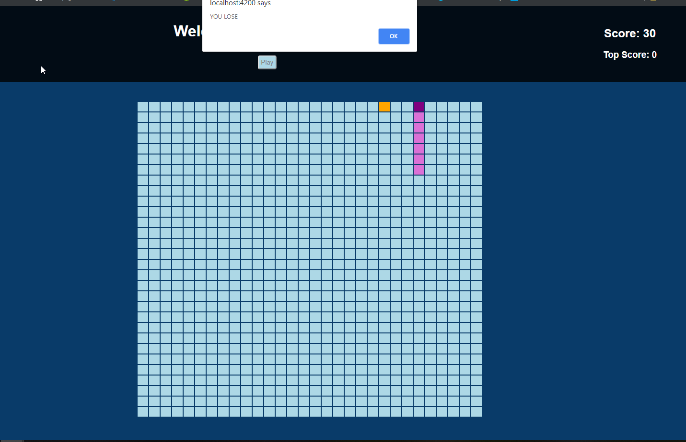
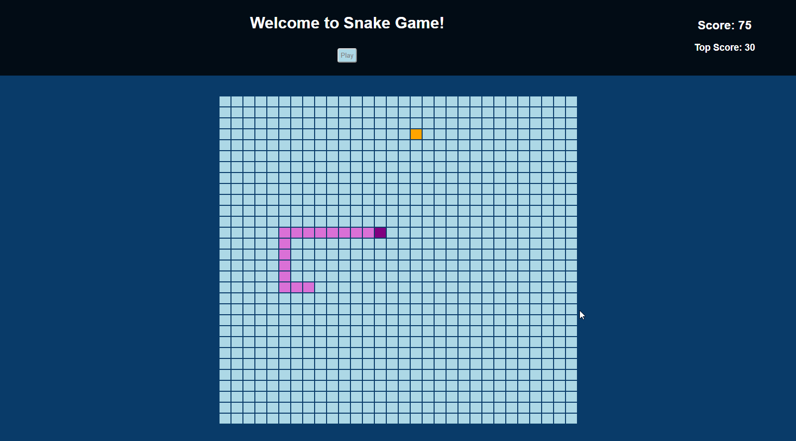

 # Lab 2 Wiki: Snake Game and Google Knowledge Graph Search API
 
  ### Objective
  This is a simple Snake game with Angular and a Google Knowledge Graph Search API. The Snake game is simple, you use the up/down/left/right arrows on the keyboard to move the snake and get to the food. The Google Graph Search API is an application that displays descriptions about people, places, and things that match certain criteria.
  
  1.	 Create a basic Snake game with Angular
  2.	 Create an application that displays the description about notable entities.

 

  ### Approach
 ### Snake Game:
 
 
 
 
The snake game is written with angular, html and css. The design and flow of the snake game are both simple and rests on a few core functions. The gameboard is built as a 2D array (list of lists in angular/JS) that is mapped to a html table using nested angular ngFor loops (to build the rows and columns). Direction is set using the directional arrows, and the game logic runs on a timer loop (angular subscription). Before updating each frame on screen, the nextFrame method evaluates if the snake will grow from eating, die from a collision or will simply move and updates the 2D array accordingly. ApplicationRef in Angular is used at the end of each frame evaluation to trigger a page wide change detection, making the next frame appear on screen. The movement of the snake is achieved by setting each childs next position to the parents current location in each frame iteration.
We started by working on getting the initial gameboard to properly display in the ngFor loops. Next we worked on methods to update the 2D to create movement on screen. Once basic movement was achieved, we worked on adding a child to the snake (eating) and getting the child to follow the parent. We created rules to detect death (hitting a wall or self) and wrapped all the methods into the nextFrame function. Lastly, we added a button to start the loop over again (play again) and keep track of the current and top score.

### Notable Entities:
The design decisions made for the notable entities application were very simple and straightforward. A simple API call is made in which the response is filtered through and returned in a “pages” array. This array is then iterated through using one-way binding in the html to render the results. We also implemented an option for the user to enter their desired search results max values, which should come in handy. 
When the page is rendered, the user is given the option of entering a search term or phrase along with a specified maximum results filter. Once the search phrase or term is entered, an API call is made to the google API and the results are returned, filtered through and displayed via divs on the main page in a simple and easy to read format. The details included for displaying are the result name and the result description.

  ### Credits
  - Ben Solomon
  - Vrusha Patel
  - Fatima Mohamed
