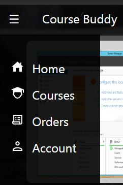
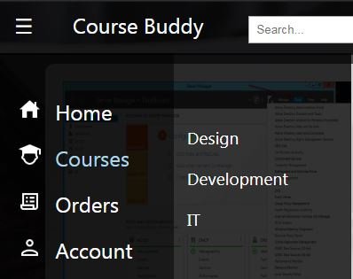
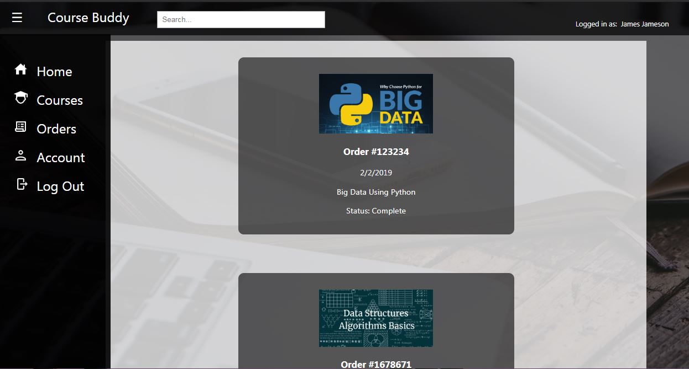
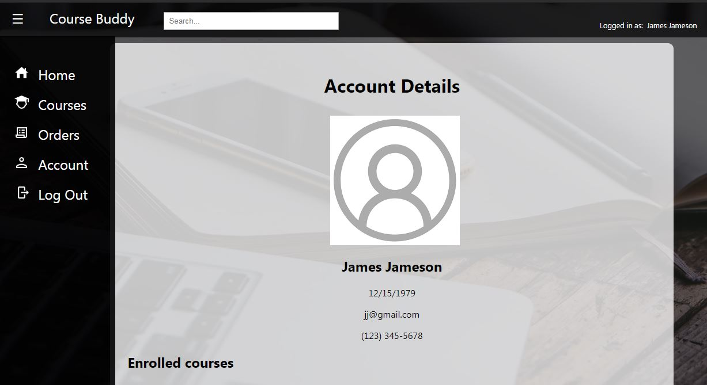
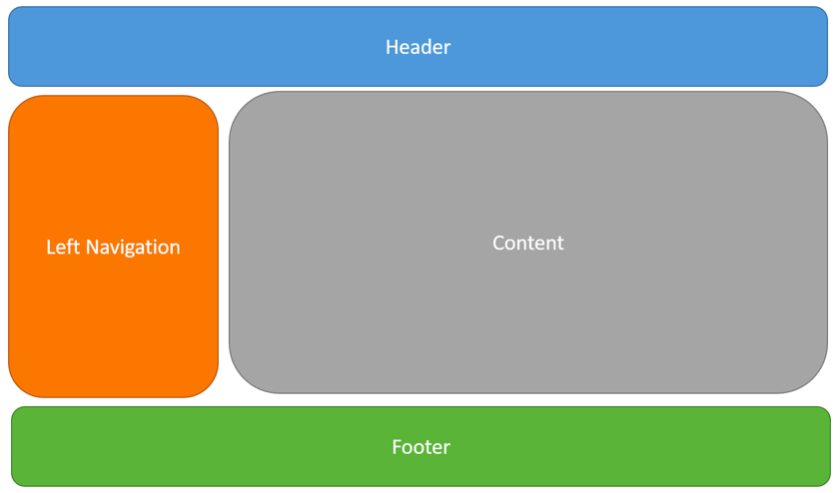

  # Lab 1 Wiki: MOOC Web Application
  ### Objective
  This is a multi-page responsive website that displays massive open online courses. It is a MOOC web application that all the user to create and account to login to or to continue as a guest. The user can select out of any of the courses listed on the web page and add them to the cart to purchase the course. The webpage also gives details on the courses that the provide and the webpage has subcategories for the types of courses that it provides.

  # Features
  
  Side Menu
  
  
  
  
  Courses
  
  
  
  
  Orders
  
  
  
  
  Account
  
  
  
  
 

  ### Approach
  Our webapp is largely designed with a MVC approach in mind. We wanted to minimize repeated code and make the development process easier and more fun for everyone in the process. The site consists of two pages: the login (login.html) page and the ‘main’ page (index.html). The index serves as the layout for the webapp, this is where content that is always displayed goes (navigation elements, headers, footers etc.)

  

  Instead of having a separate page for each functional item/area of the site, we use views. Views are just HTML code with templated data elements that get instantiated when called into view by the user (e.g clicking the Account link in the left navigation brings the Account page into the main content view). So, while the webapp has few traditional pages, it has many views and emphasizes DRY principles. This also allows us to work more efficiently not needing to chase changes in multiple pages and minimizes the risk of introducing inconsistency errors.

  Views alone are useless without something to handle the logic to manipulate the view presented to the user. With MVC style applications, the views need to interact with a controller. This layer of the application sits between the views and the data (the Models in MVC) — the Controller or View Controller fetches the data it needs on demand, and no data is static within the views. The role of the controller is handled by various javascript methods (functions.js) that respond to user interactions with the site.
  With a more developed webapp, data usually sits as far away from the view as possible, in a SQL database or a flat database file separate from the webapp itself etc. We opted for a simple approach creating arrays of objects to act like a database. We did not want to waste time debugging environmental issues with a true database and spend more time coding the things we’ve learned about in class (though having SQL queries would have been nice).

  ### Credits
  - Ben Solomon
  - Vrusha Patel
  - Fatima Mohamed
